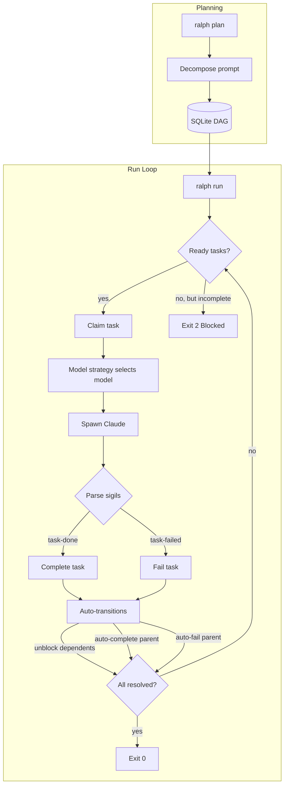

# Ralph

Autonomous agent loop harness for [Claude Code][claude-code].

Ralph decomposes a prompt into a DAG of tasks, then iteratively invokes Claude
Code to complete them one at a time. Task state lives in a SQLite database,
enabling dependency tracking, automatic unblocking, and hierarchical task
relationships. On macOS, it sandboxes Claude to restrict filesystem writes to
the project directory.

> [!WARNING]
> Ralph can (and possibly WILL) destroy anything you have access to, according
> to the whims of the LLM. Use `ralph run --once` to test before unleashing
> unattended loops.

## Installation

### Pre-built Binaries

Install the latest release with the shell installer (macOS/Linux):

```bash
curl --proto '=https' --tlsv1.2 -LsSf https://github.com/Studio-Sasquatch/ralph/releases/latest/download/ralph-installer.sh | sh
```

Pre-built binaries for all platforms are also available on the
[GitHub releases page][releases].

### From Source

```bash
cargo install --path .
```

Or build manually:

```bash
cargo build --release
./target/release/ralph --help
```

## Quick Start

```bash
ralph init                # Create .ralph.toml and directory structure
# Create specs in .ralph/specs/ and a prompt file
ralph run                 # Loop until all tasks complete
ralph run --once          # Single iteration for testing
ralph run --limit=5       # Max 5 iterations
ralph run task.md         # Use custom prompt file
```

## How It Works



1. `ralph init` creates a `.ralph.toml` config and `.ralph/` directory structure
2. `ralph plan` decomposes a prompt into a DAG of tasks stored in
   `.ralph/progress.db`
3. `ralph run` picks the next ready task (by priority, then creation time),
   claims it, and invokes Claude Code
4. Claude works on the assigned task and signals the result:
   - `<task-done>{task_id}</task-done>` — task completed, triggers
     auto-unblocking of dependents
   - `<task-failed>{task_id}</task-failed>` — task failed, auto-fails parent
5. Ralph checks if all tasks are resolved; if not and the limit hasn't been
   reached, it picks the next ready task and loops
6. Special sigils for the overall project:
   - `<promise>COMPLETE</promise>` — all tasks done, exit 0
   - `<promise>FAILURE</promise>` — critical failure, exit 1

### Project Structure

```
.ralph.toml              # Project configuration
.ralph/
  progress.db            # SQLite DAG database (gitignored)
  specs/                 # Specification documents
  prompts/               # Prompt files
```

### Happy Path

```
ralph init -> write prompt -> ralph plan -> ralph run
```

The plan decomposes the prompt into 3 tasks: A, B (depends on A), C (depends
on B). Run picks A (the only ready task), claims it, and spawns Claude. Claude
completes the work and emits `<task-done>{A}</task-done>`. Ralph marks A as
done, which unblocks B. Next iteration picks B, same flow. Then C. All tasks
resolved, exit 0.

### Task DAG

Tasks are stored in a SQLite database with:

- **Hierarchical relationships** — parent/child tasks with derived parent status
- **Dependencies** — blocker/blocked relationships with cycle detection
- **Status transitions** — `pending` → `in_progress` → `done`/`failed`, with
  auto-transitions (completing a task unblocks its dependents; completing all
  children auto-completes the parent)
- **Claim system** — each running Ralph agent gets a unique ID
  (`agent-{8 hex}`) and claims tasks atomically

## Core Principles

- **DAG-first** -- All work is tracked as tasks in a SQLite DAG. No work
  happens outside the DAG.
- **One task per iteration** -- Each Claude invocation works on exactly one
  claimed task, keeping context focused.
- **Signal-driven** -- Claude communicates results via sigils (`<task-done>`,
  `<task-failed>`, `<promise>`, `<next-model>`). Ralph never interprets
  Claude's prose.
- **Auto-transitions** -- The DAG manages cascading state changes: completing
  a task unblocks dependents; completing all children auto-completes the
  parent; failing a child auto-fails the parent.
- **Sandboxed by default** -- On macOS, Claude runs inside `sandbox-exec`
  restricting writes to the project directory and essential paths.

## Model Strategy

Ralph can swap between Claude models (`opus`, `sonnet`, `haiku`) across loop
iterations to optimize cost and capability. Use `--model-strategy` to select a
strategy, or `--model` to pin a specific model.

```bash
ralph run --model=opus                        # Always use opus (fixed)
ralph run --model-strategy=cost-optimized     # Default: pick model by progress signals
ralph run --model-strategy=escalate           # Start at haiku, escalate on errors
ralph run --model-strategy=plan-then-execute  # Opus for iteration 1, sonnet after
```

### Strategies

- **`cost-optimized`** (default) — Picks the cheapest model likely to succeed.
  Defaults to `sonnet`; escalates to `opus` on error/failure signals; drops to
  `haiku` when tasks are completing cleanly.
- **`fixed`** — Always uses the model from `--model`. No swapping.
- **`escalate`** — Starts at `haiku`. On failure signals (errors, stuck, panics),
  escalates to `sonnet` then `opus`. Never auto-de-escalates; only a Claude hint
  can step back down.
- **`plan-then-execute`** — Uses `opus` for the first iteration (planning), then
  `sonnet` for all subsequent iterations (execution).

### Claude Model Hints

Claude can override the strategy for the next iteration by emitting a
`<next-model>` sigil in its output:

```
<next-model>opus</next-model>
<next-model>sonnet</next-model>
<next-model>haiku</next-model>
```

Hints always override the strategy's choice, apply to the next iteration only,
and are optional.

## Sandbox Mode (macOS)

By default, Ralph wraps Claude in `sandbox-exec` to restrict filesystem writes:

- Allowed: project directory, temp dirs, `~/.claude`, `~/.config/claude`,
  `~/.cache`, `~/.local/state`, and git worktree root
- Blocked: everything else, plus `com.apple.systemevents` (prevents UI
  automation)

```bash
ralph run --no-sandbox       # Disable sandboxing
ralph run --allow=aws        # Grant write access to ~/.aws
```

## CLI Reference

Ralph uses a subcommand architecture:

```
ralph init                   Initialize a new Ralph project
ralph run [PROMPT_FILE]      Run the agent loop
ralph plan [PROMPT_FILE]     Decompose prompt into task DAG
ralph specs                  Author specification documents
ralph prompt                 Create a new prompt file
```

### `ralph run` Options

```
ralph run [OPTIONS] [PROMPT_FILE]

Arguments:
  [PROMPT_FILE]           Path to prompt file [default: prompt]

Options:
  -o, --once              Run exactly once
      --limit <N>         Maximum iterations (0 = unlimited)
      --model <MODEL>     Model: opus, sonnet, haiku (implies --model-strategy=fixed)
      --model-strategy <STRATEGY>
                          Strategy: fixed, cost-optimized, escalate, plan-then-execute
                          [default: cost-optimized]
      --no-sandbox        Disable macOS sandbox
  -a, --allow <RULE>      Enable sandbox rule (e.g., aws)
  -h, --help              Print help
```

### `ralph plan` Options

```
ralph plan [OPTIONS] [PROMPT_FILE]

Arguments:
  [PROMPT_FILE]           Path to prompt file [default: selects from .ralph/prompts/]

Options:
      --model <MODEL>     Model for planning [default: opus]
  -h, --help              Print help
```

### Environment Variables

| Variable               | Description                       |
| :--------------------- | :-------------------------------- |
| `RALPH_FILE`           | Default prompt file               |
| `RALPH_LIMIT`          | Default iteration limit           |
| `RALPH_ITERATION`      | Current iteration (for resume)    |
| `RALPH_TOTAL`          | Total iterations (for display)    |
| `RALPH_MODEL`          | Default model (opus/sonnet/haiku) |
| `RALPH_MODEL_STRATEGY` | Default model strategy            |

### Exit Codes

| Exit Code | Outcome      | Meaning                                    |
| --------- | ------------ | ------------------------------------------ |
| 0         | Complete     | All tasks resolved                         |
| 0         | LimitReached | Iteration limit hit (not an error)         |
| 1         | Failure      | Critical failure (FAILURE sigil or error)   |
| 2         | Blocked      | No ready tasks but incomplete tasks remain |
| 3         | NoPlan       | DAG is empty -- run `ralph plan` first     |

## Development

Requires Rust toolchain. With Nix:

```bash
nix develop
cargo build
cargo test
```

### Releases

Releases are built by [cargo-dist][cargo-dist] and published via GitHub Actions
when a `v*` tag is pushed. To cut a release: bump the version in `Cargo.toml`,
commit, tag `vX.Y.Z`, and push the tag. The CI produces platform tarballs,
an installer script, and checksums.

## Acknowledgements

Heavily inspired by [Chris Barrett's](https://github.com/chrisbarrett) shell-based ralph harness.

## License

MIT

[claude-code]: https://claude.ai/code
[releases]: https://github.com/Studio-Sasquatch/ralph/releases
[cargo-dist]: https://opensource.axo.dev/cargo-dist/
