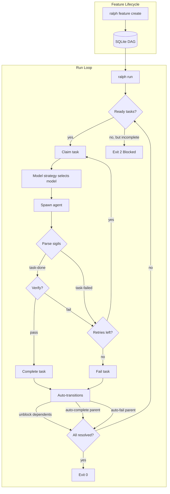

# Ralph

Autonomous agent loop harness for AI coding agents.

Ralph manages features through a structured lifecycle: specify, plan, decompose
into a DAG of tasks, then iteratively invoke an agent to complete them one at a
time. Task state lives in a SQLite database, enabling dependency tracking,
automatic unblocking, and hierarchical task relationships. Ralph works with any
[ACP][acp]-compliant agent binary -- the default is [Claude Code][claude-code],
but you can swap in any agent via the `--agent` flag, the `RALPH_AGENT`
environment variable, or the `[agent]` section in `.ralph.toml`.

> [!WARNING]
> Ralph can (and possibly WILL) destroy anything you have access to, according
> to the whims of the LLM. Use `ralph run --once` to test before unleashing
> unattended loops.

## Installation

### Pre-built Binaries

Install the latest release with the shell installer (macOS/Linux):

```bash
curl --proto '=https' --tlsv1.2 -LsSf https://github.com/Studio-Sasquatch/ralph/releases/latest/download/ralph-installer.sh | sh
```

Pre-built binaries for all platforms are also available on the
[GitHub releases page][releases].

### From Source

```bash
cargo install --path .
```

Or build manually:

```bash
cargo build --release
./target/release/ralph --help
```

## Getting Started

Ralph organizes work around **features** that progress through a defined
lifecycle: `draft` -> `planned` -> `ready` -> `running` -> `done`/`failed`.

```bash
# 1. Initialize a Ralph project
ralph init

# 2. Create a feature (interactive spec → plan → task DAG)
ralph feature create auth

# 3. Run the agent loop
ralph run auth
```

The `feature create` command runs the entire lifecycle in one shot: a spec
interview (you collaborate with the agent to refine a specification), an
automated review pass, a plan interview (you refine the implementation plan),
another review pass, and finally DAG decomposition into concrete tasks. Each
phase skips if its output file already exists on disk, so you can resume an
interrupted `feature create` without losing progress.

For quick one-off work, create standalone tasks instead:

```bash
ralph task add "Fix the login bug"   # Non-interactive, scriptable
ralph task create                     # Interactive, Claude-assisted
ralph task list                       # See what you have
ralph run t-abc123                    # Run a specific task by ID
```

## How It Works



1. `ralph feature create <name>` runs an interactive session to craft a
   specification, then creates an implementation plan, then decomposes the plan
   into a DAG of tasks stored in `.ralph/progress.db` -- all in one command
2. `ralph run <target>` picks the next ready task (by priority, then creation
   time), claims it, and invokes the agent
3. The agent works on the assigned task and signals the result:
   - `<task-done>{task_id}</task-done>` -- task completed, triggers
     auto-unblocking of dependents
   - `<task-failed>{task_id}</task-failed>` -- task failed, retried up to
     `--max-retries` times
4. After each task completion, a **verification agent** (a read-only agent
   session) checks the work. On failure, the task is retried.
5. Ralph checks if all tasks are resolved; if not and the limit has not been
   reached, it picks the next ready task and loops

### Project Structure

```
.ralph.toml              # Project configuration ([execution], [agent])
.ralph/
  progress.db            # SQLite DAG database (gitignored)
  features/              # Feature specs and plans
    <name>/
      spec.md            # Feature specification
      plan.md            # Implementation plan
  knowledge/             # Project knowledge entries
    <entry-name>.md      # Tagged markdown knowledge file
.claude/
  skills/                # Reusable agent skills
    <name>/
      SKILL.md           # Skill definition with YAML frontmatter
```

### Configuration

The `.ralph.toml` file controls project-level defaults:

```toml
[execution]
# max_retries = 3
# verify = true

[agent]
# command = "claude"
```

### Task DAG

Tasks are stored in a SQLite database with:

- **Hierarchical relationships** -- parent/child tasks with derived parent status
- **Dependencies** -- blocker/blocked relationships with cycle detection
- **Status transitions** -- `pending` -> `in_progress` -> `done`/`failed`, with
  auto-transitions (completing a task unblocks its dependents; completing all
  children auto-completes the parent)
- **Claim system** -- each running Ralph agent gets a unique ID
  (`agent-{8 hex}`) and claims tasks atomically
- **Feature scoping** -- tasks belong to features and are queried by feature
  context during execution

## Core Principles

- **Feature-driven** -- Work is organized into features with specifications,
  plans, and task DAGs. The lifecycle provides structure and traceability.
- **DAG-first** -- All work is tracked as tasks in a SQLite DAG. No work
  happens outside the DAG.
- **One task per iteration** -- Each agent invocation works on exactly one
  claimed task, keeping context focused.
- **Signal-driven** -- The agent communicates results via sigils (`<task-done>`,
  `<task-failed>`, `<promise>`, `<next-model>`). Ralph never interprets
  the agent's prose.
- **Auto-transitions** -- The DAG manages cascading state changes: completing
  a task unblocks dependents; completing all children auto-completes the
  parent; failing a child auto-fails the parent.
- **Verify then trust** -- A read-only verification agent checks each
  completed task before accepting it.
- **Agent-agnostic** -- Ralph works with any ACP-compliant agent binary,
  configurable via `--agent` flag, `RALPH_AGENT` env var, or `[agent].command`
  in `.ralph.toml`. The default agent is `claude`.

## Verification

After each task completion, Ralph spawns a read-only agent session that:

1. Reads the relevant source files
2. Runs applicable tests
3. Checks acceptance criteria from the task description
4. Emits `<verify-pass/>` or `<verify-fail>reason</verify-fail>`

Failed verifications trigger a retry (up to `--max-retries`). Disable
verification with `--no-verify`.

## Journal and Knowledge

Ralph maintains two complementary memory systems that feed context into each
iteration's system prompt:

- **Run Journal** -- Each iteration writes a journal entry to SQLite (outcome,
  model, duration, cost, files modified, notes from `<journal>` sigils). Smart
  selection combines recent entries from the current run with FTS5 full-text
  search matches from prior runs, within a 3000-token budget.
- **Project Knowledge** -- Reusable knowledge entries stored as tagged markdown
  files in `.ralph/knowledge/`. The agent emits `<knowledge>` sigils to create
  entries. Discovery scans the directory and scores entries by tag relevance to
  the current task, feature, and recently modified files. Entries support
  `[[Title]]` references for zettelkasten-style cross-linking; link expansion
  pulls in related entries not directly matched by tags. Rendered within a
  2000-token budget.

Both systems are always active -- there is no toggle to disable them.

## Model Strategy

Ralph swaps between Claude models (`opus`, `sonnet`, `haiku`) across loop
iterations to optimize cost and capability. Use `--model-strategy` to select a
strategy, or `--model` to pin a specific model.

```bash
ralph run auth --model=opus                        # Always use opus (fixed)
ralph run auth --model-strategy=cost-optimized     # Default: pick model by progress signals
ralph run auth --model-strategy=escalate           # Start at haiku, escalate on errors
ralph run auth --model-strategy=plan-then-execute  # Opus for iteration 1, sonnet after
```

### Strategies

- **`cost-optimized`** (default) -- Picks the cheapest model likely to succeed.
  Defaults to `sonnet`; escalates to `opus` on error/failure signals; drops to
  `haiku` when tasks are completing cleanly.
- **`fixed`** -- Always uses the model from `--model`. No swapping.
- **`escalate`** -- Starts at `haiku`. On failure signals (errors, stuck, panics),
  escalates to `sonnet` then `opus`. Never auto-de-escalates; only a Claude hint
  can step back down.
- **`plan-then-execute`** -- Uses `opus` for the first iteration (planning), then
  `sonnet` for all subsequent iterations (execution).

### Claude Model Hints

Claude can override the strategy for the next iteration by emitting a
`<next-model>` sigil in its output:

```
<next-model>opus</next-model>
<next-model>sonnet</next-model>
<next-model>haiku</next-model>
```

Hints always override the strategy's choice, apply to the next iteration only,
and are optional.

## CLI Reference

```
ralph init                        Initialize a new Ralph project
ralph feature create <name>       Create feature: spec → plan → task DAG
ralph feature list                List all features and their status
ralph task add <TITLE>            Add a standalone task (scriptable)
ralph task create                 Interactively create a task (Claude-assisted)
ralph task list                   List tasks
ralph run <target>                Run the agent loop on a feature or task
ralph auth                        Authenticate with the agent
```

### `ralph run` Options

```
ralph run [OPTIONS] <TARGET>

Arguments:
  <TARGET>                Feature name or task ID (t-...)

Options:
  -o, --once              Run exactly once
      --limit <N>         Maximum iterations (0 = unlimited)
      --model <MODEL>     Model: opus, sonnet, haiku (implies --model-strategy=fixed)
      --model-strategy <STRATEGY>
                          Strategy: fixed, cost-optimized, escalate, plan-then-execute
                          [default: cost-optimized]
      --max-retries <N>   Maximum retries for failed tasks
      --no-verify         Disable autonomous verification
      --agent <CMD>       Agent command (env: RALPH_AGENT, default: claude)
  -h, --help              Print help
```

### `ralph feature` Options

The `create` subcommand accepts `--model <MODEL>` and `--agent <CMD>` flags.

### Environment Variables

| Variable               | Description                       |
| :--------------------- | :-------------------------------- |
| `RALPH_LIMIT`          | Default iteration limit           |
| `RALPH_MODEL`          | Default model (opus/sonnet/haiku) |
| `RALPH_MODEL_STRATEGY` | Default model strategy            |
| `RALPH_AGENT`          | Agent command (default: claude)    |
| `RALPH_ITERATION`      | Current iteration (for resume)    |
| `RALPH_TOTAL`          | Total iterations (for display)    |

### Exit Codes

| Exit Code | Outcome      | Meaning                                    |
| --------- | ------------ | ------------------------------------------ |
| 0         | Complete     | All tasks resolved                         |
| 0         | LimitReached | Iteration limit hit (not an error)         |
| 1         | Failure      | Critical failure (FAILURE sigil or error)   |
| 2         | Blocked      | No ready tasks but incomplete tasks remain |
| 3         | NoPlan       | DAG is empty -- run `ralph feature create` |

## Development

Requires Rust toolchain. With Nix:

```bash
nix develop
cargo build
cargo test
```

### Releases

Releases are built by [cargo-dist][cargo-dist] and published via GitHub Actions
when a `v*` tag is pushed. To cut a release: bump the version in `Cargo.toml`,
commit, tag `vX.Y.Z`, and push the tag. The CI produces platform tarballs,
an installer script, and checksums.

## Acknowledgements

Heavily inspired by [Chris Barrett's](https://github.com/chrisbarrett) shell-based ralph harness.

## License

MIT

[acp]: https://github.com/agentclientprotocol/rust-sdk
[claude-code]: https://claude.ai/code
[releases]: https://github.com/Studio-Sasquatch/ralph/releases
[cargo-dist]: https://opensource.axo.dev/cargo-dist/
