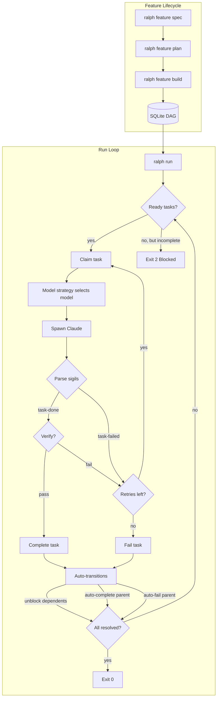

# Ralph

Autonomous agent loop harness for [Claude Code][claude-code].

Ralph manages features through a structured lifecycle: specify, plan, decompose
into a DAG of tasks, then iteratively invoke Claude Code to complete them one at
a time. Task state lives in a SQLite database, enabling dependency tracking,
automatic unblocking, and hierarchical task relationships. On macOS, it sandboxes
Claude to restrict filesystem writes to the project directory.

> [!WARNING]
> Ralph can (and possibly WILL) destroy anything you have access to, according
> to the whims of the LLM. Use `ralph run --once` to test before unleashing
> unattended loops.

## Installation

### Pre-built Binaries

Install the latest release with the shell installer (macOS/Linux):

```bash
curl --proto '=https' --tlsv1.2 -LsSf https://github.com/Studio-Sasquatch/ralph/releases/latest/download/ralph-installer.sh | sh
```

Pre-built binaries for all platforms are also available on the
[GitHub releases page][releases].

### From Source

```bash
cargo install --path .
```

Or build manually:

```bash
cargo build --release
./target/release/ralph --help
```

## Getting Started

Ralph organizes work around **features** that progress through a defined
lifecycle: `draft` -> `planned` -> `ready` -> `running` -> `done`/`failed`.

```bash
# 1. Initialize a Ralph project
ralph init

# 2. Craft a specification (interactive Claude session)
ralph feature spec auth

# 3. Create an implementation plan from the spec (interactive Claude session)
ralph feature plan auth

# 4. Decompose the plan into a task DAG
ralph feature build auth

# 5. Run the agent loop
ralph run auth
```

Each step builds on the previous one. The `spec` and `plan` commands open
interactive Claude sessions where you collaborate to refine the specification and
plan. The `build` command decomposes the plan into concrete tasks stored in the
DAG. Finally, `run` picks tasks one at a time and invokes Claude to complete
them.

For quick one-off work, create standalone tasks instead:

```bash
ralph task new              # Interactive: create a standalone task
ralph task list             # See what you have
ralph run t-abc123          # Run a specific task by ID
```

## How It Works



1. `ralph feature spec <name>` creates a feature in `draft` state and opens an
   interactive Claude session to craft a specification
2. `ralph feature plan <name>` creates an implementation plan from the spec
3. `ralph feature build <name>` decomposes the plan into a DAG of tasks stored
   in `.ralph/progress.db`
4. `ralph run <target>` picks the next ready task (by priority, then creation
   time), claims it, and invokes Claude Code
5. Claude works on the assigned task and signals the result:
   - `<task-done>{task_id}</task-done>` -- task completed, triggers
     auto-unblocking of dependents
   - `<task-failed>{task_id}</task-failed>` -- task failed, retried up to
     `--max-retries` times
6. After each task completion, a **verification agent** (a read-only Claude
   session) checks the work. On failure, the task is retried.
7. Ralph checks if all tasks are resolved; if not and the limit has not been
   reached, it picks the next ready task and loops

### Project Structure

```
.ralph.toml              # Project configuration
.ralph/
  progress.db            # SQLite DAG database (gitignored)
  features/              # Feature specs and plans
    <name>/
      spec.md            # Feature specification
      plan.md            # Implementation plan
  skills/                # Reusable agent skills
    <name>/
      SKILL.md           # Skill definition with YAML frontmatter
  specs/                 # Specification documents (legacy)
  prompts/               # Prompt files
```

### Configuration

The `.ralph.toml` file controls project-level defaults:

```toml
[specs]
# dirs = [".ralph/specs"]

[prompts]
# dir = ".ralph/prompts"

[execution]
# max_retries = 3
# verify = true
# learn = true
```

### Task DAG

Tasks are stored in a SQLite database with:

- **Hierarchical relationships** -- parent/child tasks with derived parent status
- **Dependencies** -- blocker/blocked relationships with cycle detection
- **Status transitions** -- `pending` -> `in_progress` -> `done`/`failed`, with
  auto-transitions (completing a task unblocks its dependents; completing all
  children auto-completes the parent)
- **Claim system** -- each running Ralph agent gets a unique ID
  (`agent-{8 hex}`) and claims tasks atomically
- **Feature scoping** -- tasks belong to features and are queried by feature
  context during execution

## Core Principles

- **Feature-driven** -- Work is organized into features with specifications,
  plans, and task DAGs. The lifecycle provides structure and traceability.
- **DAG-first** -- All work is tracked as tasks in a SQLite DAG. No work
  happens outside the DAG.
- **One task per iteration** -- Each Claude invocation works on exactly one
  claimed task, keeping context focused.
- **Signal-driven** -- Claude communicates results via sigils (`<task-done>`,
  `<task-failed>`, `<promise>`, `<next-model>`). Ralph never interprets
  Claude's prose.
- **Auto-transitions** -- The DAG manages cascading state changes: completing
  a task unblocks dependents; completing all children auto-completes the
  parent; failing a child auto-fails the parent.
- **Verify then trust** -- A read-only verification agent checks each
  completed task before accepting it.
- **Sandboxed by default** -- On macOS, Claude runs inside `sandbox-exec`
  restricting writes to the project directory and essential paths.

## Verification

After each task completion, Ralph spawns a read-only Claude session that:

1. Reads the relevant source files
2. Runs applicable tests
3. Checks acceptance criteria from the task description
4. Emits `<verify-pass/>` or `<verify-fail>reason</verify-fail>`

Failed verifications trigger a retry (up to `--max-retries`). Disable
verification with `--no-verify`.

## Skills and Learning

Ralph supports a skills system for reusable agent knowledge:

- **Skills** are stored in `.ralph/skills/<name>/SKILL.md` with YAML frontmatter
- Skills are discovered automatically each iteration and included in the agent's
  context
- When **learning mode** is enabled (default), Claude can create new skills and
  update `CLAUDE.md` based on what it learns during execution

Disable learning with `--no-learn`.

## Model Strategy

Ralph swaps between Claude models (`opus`, `sonnet`, `haiku`) across loop
iterations to optimize cost and capability. Use `--model-strategy` to select a
strategy, or `--model` to pin a specific model.

```bash
ralph run auth --model=opus                        # Always use opus (fixed)
ralph run auth --model-strategy=cost-optimized     # Default: pick model by progress signals
ralph run auth --model-strategy=escalate           # Start at haiku, escalate on errors
ralph run auth --model-strategy=plan-then-execute  # Opus for iteration 1, sonnet after
```

### Strategies

- **`cost-optimized`** (default) -- Picks the cheapest model likely to succeed.
  Defaults to `sonnet`; escalates to `opus` on error/failure signals; drops to
  `haiku` when tasks are completing cleanly.
- **`fixed`** -- Always uses the model from `--model`. No swapping.
- **`escalate`** -- Starts at `haiku`. On failure signals (errors, stuck, panics),
  escalates to `sonnet` then `opus`. Never auto-de-escalates; only a Claude hint
  can step back down.
- **`plan-then-execute`** -- Uses `opus` for the first iteration (planning), then
  `sonnet` for all subsequent iterations (execution).

### Claude Model Hints

Claude can override the strategy for the next iteration by emitting a
`<next-model>` sigil in its output:

```
<next-model>opus</next-model>
<next-model>sonnet</next-model>
<next-model>haiku</next-model>
```

Hints always override the strategy's choice, apply to the next iteration only,
and are optional.

## Sandbox Mode (macOS)

By default, Ralph wraps Claude in `sandbox-exec` to restrict filesystem writes:

- Allowed: project directory, temp dirs, `~/.claude`, `~/.config/claude`,
  `~/.cache`, `~/.local/state`, and git worktree root
- Blocked: everything else, plus `com.apple.systemevents` (prevents UI
  automation)

```bash
ralph run auth --no-sandbox       # Disable sandboxing
ralph run auth --allow=aws        # Grant write access to ~/.aws
```

## CLI Reference

```
ralph init                        Initialize a new Ralph project
ralph feature spec <name>         Interactively craft a specification
ralph feature plan <name>         Interactively create an implementation plan
ralph feature build <name>        Decompose plan into task DAG
ralph feature list                List all features and their status
ralph task new                    Interactively create a standalone task
ralph task list                   List standalone tasks
ralph run <target>                Run the agent loop on a feature or task
```

### `ralph run` Options

```
ralph run [OPTIONS] <TARGET>

Arguments:
  <TARGET>                Feature name or task ID (t-...)

Options:
  -o, --once              Run exactly once
      --limit <N>         Maximum iterations (0 = unlimited)
      --model <MODEL>     Model: opus, sonnet, haiku (implies --model-strategy=fixed)
      --model-strategy <STRATEGY>
                          Strategy: fixed, cost-optimized, escalate, plan-then-execute
                          [default: cost-optimized]
      --max-retries <N>   Maximum retries for failed tasks
      --no-verify         Disable autonomous verification
      --no-learn          Disable skill creation + CLAUDE.md updates
      --no-sandbox        Disable macOS sandbox
  -a, --allow <RULE>      Enable sandbox rule (e.g., aws)
  -h, --help              Print help
```

### `ralph feature` Options

The `spec`, `plan`, and `build` subcommands each accept an optional
`--model <MODEL>` flag to choose the Claude model (defaults to `opus`).

### Environment Variables

| Variable               | Description                       |
| :--------------------- | :-------------------------------- |
| `RALPH_LIMIT`          | Default iteration limit           |
| `RALPH_MODEL`          | Default model (opus/sonnet/haiku) |
| `RALPH_MODEL_STRATEGY` | Default model strategy            |
| `RALPH_ITERATION`      | Current iteration (for resume)    |
| `RALPH_TOTAL`          | Total iterations (for display)    |

### Exit Codes

| Exit Code | Outcome      | Meaning                                    |
| --------- | ------------ | ------------------------------------------ |
| 0         | Complete     | All tasks resolved                         |
| 0         | LimitReached | Iteration limit hit (not an error)         |
| 1         | Failure      | Critical failure (FAILURE sigil or error)   |
| 2         | Blocked      | No ready tasks but incomplete tasks remain |
| 3         | NoPlan       | DAG is empty -- run `ralph feature build`  |

## Development

Requires Rust toolchain. With Nix:

```bash
nix develop
cargo build
cargo test
```

### Releases

Releases are built by [cargo-dist][cargo-dist] and published via GitHub Actions
when a `v*` tag is pushed. To cut a release: bump the version in `Cargo.toml`,
commit, tag `vX.Y.Z`, and push the tag. The CI produces platform tarballs,
an installer script, and checksums.

## Acknowledgements

Heavily inspired by [Chris Barrett's](https://github.com/chrisbarrett) shell-based ralph harness.

## License

MIT

[claude-code]: https://claude.ai/code
[releases]: https://github.com/Studio-Sasquatch/ralph/releases
[cargo-dist]: https://opensource.axo.dev/cargo-dist/
